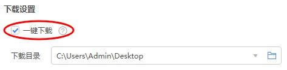
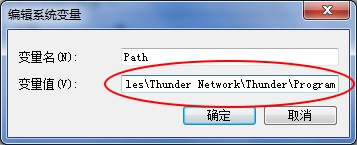
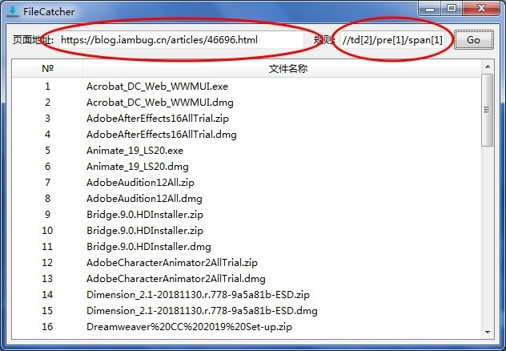

# FileCatcher

FileCatcher是用于从网页抓取文件下载地址并提供下载的程序。

## 下载

https://github.com/YangGerald/FileCatcher/releases/latest

## 用法

1.安装[迅雷](https://www.xunlei.com/)。

2.在桌面右击“计算机”，依次点击“属性->高级系统设置->环境变量”，在系统变量中找到“Path”变量并添加迅雷的安装路径（例如`C:\Program Files (x86)\Thunder Network\Thunder\Program`），各个路径之间需要用`;`隔开。

3.下载并安装[FileCatcher](https://github.com/YangGerald/FileCatcher/releases/latest)。

4.安装完成后，打开FileCatcher，同时迅雷也会跟着自动启动，请在迅雷的下载设置勾选“一键下载”。

5.输入页面地址和规则去进行下载文件。其中，**页面地址**为含有文件下载地址页面的网址，**规则**为XPath选取节点或节点集使用的路径表达式。其规则可以使用[ChroPath](https://autonomiq.io/deviq-chropath.html)自动生成，而不必要求我们对XPath具备专业的知识，例如ChroPath生成的表达式为：`/html[1]/body[1]/div[1]/div[1]/div[1]/section[1]/article[1]/div[2]/div[1]/figure[1]/table[1]/tbody[1]/tr[1]/td[2]/pre[1]/span[1]`，规则输入`//td[2]/pre[1]/span[1]`即可。

## 致谢

感谢[Pixel perfect](https://www.flaticon.com/authors/pixel-perfect)提供的图标，还有其他叫不出名字的朋友。

## 许可证

[MIT](LICENSE)